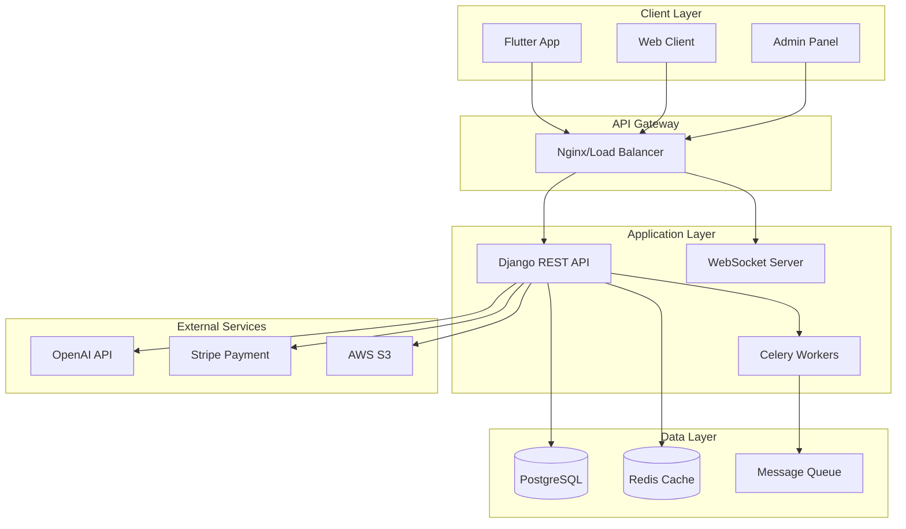

# 🎓 StudyMate API Server

<div align="center">
  
  
  
  
  
  
</div>

<div align="center">
  <h3>🚀 AI 기반 스마트 학습 플랫폼 백엔드 API</h3>
  <p>Django REST Framework로 구축된 엔터프라이즈급 학습 관리 시스템</p>
  
  [📚 문서](#-문서) • [🚀 시작하기](#-빠른-시작) • [🔧 API](#-api-엔드포인트) • [📦 배포](#-배포) • [🤝 기여](#-기여하기)
</div>

---

## 📌 프로젝트 개요

**StudyMate API**는 AI 기술을 활용한 개인화 학습 플랫폼의 백엔드 서버입니다. Django REST Framework를 기반으로 구축되었으며, 실시간 협업, 지능형 콘텐츠 생성, 학습 분석 등 고급 기능을 제공합니다.

### 🌐 라이브 서버
- **API 서버**: http://54.161.77.144/
- **상태**: ✅ 운영 중
- **문서**: [배포 현황](./DEPLOYMENT_STATUS.md)

### ✨ 주요 특징

- 🤖 **AI 기반 학습**: OpenAI/Anthropic API를 활용한 콘텐츠 생성
- 🔄 **무중단 배포**: Blue-Green 배포 전략으로 서비스 중단 없이 업데이트
- 📊 **실시간 분석**: WebSocket 기반 실시간 학습 데이터 분석
- 🔒 **보안 강화**: JWT 인증, Rate Limiting, CORS 설정
- ⚡ **고성능**: Redis 캐싱, 쿼리 최적화, 비동기 처리
- 🌐 **확장 가능**: 마이크로서비스 아키텍처 준비

---

## 🏗 시스템 아키텍처



---

## 🚀 빠른 시작

### 📋 필수 요구사항

- Python 3.10+
- PostgreSQL 15+
- Redis 6+
- Git

### 🔧 로컬 개발 환경 설정

```bash
# 1. 저장소 클론
git clone https://github.com/dugadak/StudyMate-API.git
cd StudyMate-API

# 2. 가상환경 생성 및 활성화
python3 -m venv venv
source venv/bin/activate  # Windows: venv\Scripts\activate

# 3. 의존성 설치
pip install -r requirements.txt

# 4. 환경 변수 설정
cp .env.example .env
# .env 파일을 편집하여 필요한 값 설정

# 5. 데이터베이스 마이그레이션
python manage.py migrate

# 6. 정적 파일 수집
python manage.py collectstatic --noinput

# 7. 슈퍼유저 생성
python manage.py createsuperuser

# 8. 개발 서버 실행
python manage.py runserver
```

### 🐳 Docker로 실행

```bash
# Docker Compose로 전체 스택 실행
docker-compose up -d

# 마이그레이션 실행
docker-compose exec web python manage.py migrate

# 슈퍼유저 생성
docker-compose exec web python manage.py createsuperuser
```

서버가 http://localhost:8000 에서 실행됩니다.

---

## 📦 배포

### 🌩 AWS EC2 배포 (프리티어)

#### 1️⃣ EC2 인스턴스 설정
```bash
# EC2 접속
ssh -i your-key.pem ec2-user@your-ec2-ip

# 초기 설정 스크립트 실행
curl -O https://raw.githubusercontent.com/dugadak/StudyMate-API/main/scripts/setup_ec2.sh
chmod +x setup_ec2.sh
./setup_ec2.sh
```

#### 2️⃣ GitHub Actions CI/CD
main 브랜치에 푸시하면 자동으로 배포됩니다:
- 테스트 실행
- Blue-Green 무중단 배포
- 헬스 체크
- 실패 시 자동 롤백

#### 3️⃣ 수동 배포
```bash
# 로컬에서 배포 스크립트 실행
cd scripts/deploy
./deploy_to_ec2.sh
```

자세한 내용은 [DEPLOYMENT.md](DEPLOYMENT.md) 및 [배포 현황](DEPLOYMENT_STATUS.md) 참조

### 🔑 GitHub Secrets 설정

| Secret | 설명 |
|--------|------|
| `EC2_HOST` | EC2 퍼블릭 IP |
| `EC2_PRIVATE_KEY` | SSH 프라이빗 키 |
| `SLACK_WEBHOOK` | (선택) Slack 알림 URL |

---

## 🔧 API 엔드포인트

### 인증 (Authentication)
| Method | Endpoint | 설명 |
|--------|----------|------|
| POST | `/api/auth/register/` | 회원가입 |
| POST | `/api/auth/login/` | 로그인 |
| POST | `/api/auth/refresh/` | 토큰 갱신 |
| POST | `/api/auth/logout/` | 로그아웃 |

### 홈 대시보드
| Method | Endpoint | 설명 |
|--------|----------|------|
| GET | `/api/home/dashboard/` | 대시보드 데이터 |
| GET | `/api/home/stats/` | 학습 통계 |
| GET | `/api/home/recommendations/` | AI 추천 |

### 학습 관리
| Method | Endpoint | 설명 |
|--------|----------|------|
| GET/POST | `/api/study/summaries/` | 학습 요약 |
| GET/POST | `/api/quiz/` | 퀴즈 관리 |
| POST | `/api/study/generate/` | AI 콘텐츠 생성 |

### 실시간 협업
| Method | Endpoint | 설명 |
|--------|----------|------|
| GET/POST | `/api/collaboration/rooms/` | 퀴즈 룸 |
| WS | `/ws/quiz/{room_id}/` | 실시간 퀴즈 |

전체 API 문서: http://localhost:8000/api/docs/

---

## 📂 프로젝트 구조

```
StudyMate-API/
├── 📁 .github/workflows/     # CI/CD 파이프라인
├── 📁 accounts/              # 사용자 인증 및 계정
├── 📁 home/                  # 홈 대시보드
├── 📁 study/                 # 학습 관리
├── 📁 quiz/                  # 퀴즈 시스템
├── 📁 collaboration/         # 실시간 협업
├── 📁 stats/                 # 통계 및 분석
├── 📁 notifications/         # 알림 시스템
├── 📁 subscription/          # 구독 및 결제
├── 📁 studymate_api/         # 프로젝트 설정
├── 📁 scripts/               # 배포 스크립트
│   ├── setup_ec2.sh         # EC2 초기 설정
│   ├── deploy.sh            # 무중단 배포
│   └── rollback.sh          # 긴급 롤백
├── 📁 tests/                 # 테스트 코드
├── 📁 docs/                  # 문서
├── 📄 .env.example           # 환경 변수 템플릿
├── 📄 requirements.txt       # Python 패키지
├── 📄 docker-compose.yml     # Docker 설정
└── 📄 manage.py             # Django 관리
```

---

## 🧪 테스트

```bash
# 전체 테스트 실행
python manage.py test

# 커버리지 리포트
pytest --cov=. --cov-report=html

# 특정 앱 테스트
python manage.py test accounts

# 병렬 테스트 (빠른 실행)
python manage.py test --parallel
```

---

## 📊 모니터링

### 로그 확인
```bash
# 애플리케이션 로그
tail -f logs/studymate.log

# 에러 로그
tail -f logs/errors.log

# 성능 로그
tail -f logs/performance.log
```

### 헬스 체크
- 상태: `GET /health/`
- 메트릭: `GET /metrics/`

---

## 🔒 보안

- **인증**: JWT 토큰 기반
- **권한**: Role-based Access Control
- **암호화**: HTTPS 전용 (프로덕션)
- **Rate Limiting**: API 호출 제한
- **CORS**: 허용된 도메인만 접근
- **SQL Injection 방지**: ORM 사용
- **XSS 방지**: 입력 값 검증

---

## 📚 문서

| 문서 | 설명 |
|------|------|
| [DEPLOYMENT.md](DEPLOYMENT.md) | 배포 가이드 |
| [AWS_SETUP_GUIDE.md](AWS_SETUP_GUIDE.md) | AWS 설정 가이드 |
| [API_DOCUMENTATION.md](docs/API_DOCUMENTATION.md) | API 상세 문서 |
| [ARCHITECTURE.md](docs/ARCHITECTURE.md) | 시스템 아키텍처 |
| [DEVELOPMENT_GUIDE.md](docs/DEVELOPMENT_GUIDE.md) | 개발 가이드 |

---

## 🤝 기여하기

우리는 커뮤니티의 기여를 환영합니다!

1. Fork 저장소
2. Feature 브랜치 생성 (`git checkout -b feature/AmazingFeature`)
3. 변경사항 커밋 (`git commit -m 'Add: 멋진 기능'`)
4. 브랜치 푸시 (`git push origin feature/AmazingFeature`)
5. Pull Request 생성

### 커밋 컨벤션
- `Add:` 새로운 기능
- `Fix:` 버그 수정
- `Update:` 기능 개선
- `Docs:` 문서 수정
- `Test:` 테스트 추가
- `Refactor:` 코드 리팩토링

---

## 📈 성능 최적화

- **쿼리 최적화**: select_related, prefetch_related 사용
- **캐싱**: Redis를 활용한 응답 캐싱
- **비동기 처리**: Celery를 통한 백그라운드 작업
- **DB 인덱싱**: 자주 조회되는 필드 인덱스
- **페이지네이션**: 대량 데이터 처리
- **압축**: Gzip 압축 활성화

---

## 🐛 트러블슈팅

### 일반적인 문제

| 문제 | 해결 방법 |
|------|----------|
| 마이그레이션 에러 | `python manage.py migrate --run-syncdb` |
| 포트 충돌 | 다른 포트 사용: `python manage.py runserver 8001` |
| Redis 연결 실패 | Redis 서버 시작: `redis-server` |
| 정적 파일 404 | `python manage.py collectstatic` |

더 많은 해결 방법은 [Issues](https://github.com/dugadak/StudyMate-API/issues) 참조

---

## 📄 라이선스

이 프로젝트는 독점 소프트웨어입니다. 무단 복제 및 배포를 금지합니다.

---

## 📞 지원

- 📧 이메일: support@studymate.com
- 🐛 버그 리포트: [GitHub Issues](https://github.com/dugadak/StudyMate-API/issues)
- 💬 디스코드: [StudyMate Community](https://discord.gg/studymate)

---

<div align="center">
  <h3>🌟 StudyMate와 함께 더 스마트한 학습을 시작하세요! 🌟</h3>
  <p>Made with ❤️ by StudyMate Team</p>
  
  ⭐ 이 프로젝트가 도움이 되었다면 Star를 눌러주세요!
</div>