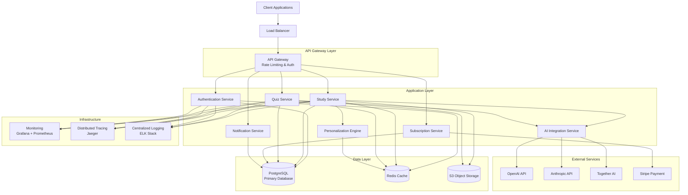

# StudyMate API 시스템 아키텍처

## 🏗 전체 아키텍처 개요

StudyMate API는 마이크로서비스 아키텍처를 기반으로 한 확장 가능하고 유연한 학습 플랫폼입니다.



## 🎯 핵심 설계 원칙

### 1. 마이크로서비스 아키텍처
- **서비스 분리**: 각 도메인별 독립적인 서비스
- **느슨한 결합**: 서비스 간 최소한의 의존성
- **데이터 소유권**: 각 서비스가 자체 데이터 소유
- **독립적 배포**: 서비스별 독립 배포 가능

### 2. API-First 설계
- **RESTful API**: 표준 HTTP 메서드 사용
- **OpenAPI 문서화**: 자동 API 문서 생성
- **버전 관리**: URL 기반 API 버전 관리
- **일관성**: 모든 서비스에서 동일한 API 패턴

### 3. 확장성 및 성능
- **수평 확장**: 로드 밸런서와 다중 인스턴스
- **캐싱 전략**: Redis를 활용한 다층 캐싱
- **비동기 처리**: Celery를 통한 백그라운드 작업
- **데이터베이스 최적화**: 읽기 전용 복제본 활용

### 4. 보안 및 신뢰성
- **Zero Trust 보안**: 모든 요청 검증
- **JWT 인증**: 상태 없는 토큰 기반 인증
- **암호화**: 전송 및 저장 데이터 암호화
- **모니터링**: 실시간 보안 위협 감지

## 🏢 서비스 상세 구조

### 인증 서비스 (Authentication Service)
```python
# 주요 책임
- 사용자 등록 및 로그인
- JWT 토큰 발행 및 검증
- 비밀번호 재설정
- 소셜 로그인 (Google, GitHub)
- MFA (Multi-Factor Authentication)

# 기술 스택
- Django REST Framework
- JWT Authentication
- OAuth 2.0
- Redis (세션 스토어)
```

### 학습 서비스 (Study Service)
```python
# 주요 책임
- 학습 세션 관리
- 진도 추적
- AI 요약 생성
- 학습 분석
- 복습 스케줄링

# 주요 모델
class StudySession(models.Model):
    user = models.ForeignKey(User)
    subject = models.ForeignKey(Subject)
    content = models.TextField()
    status = models.CharField(max_length=20)
    created_at = models.DateTimeField(auto_now_add=True)
    
class StudyProgress(models.Model):
    user = models.ForeignKey(User)
    subject = models.ForeignKey(Subject)
    completion_rate = models.FloatField()
    last_activity = models.DateTimeField()
```

### AI 통합 서비스 (AI Integration Service)
```python
# 주요 책임
- 다중 AI 제공자 관리 (OpenAI, Anthropic, Together)
- A/B 테스트를 통한 모델 성능 최적화
- 요약 생성
- 퀴즈 자동 생성
- 개인화 추천

# AI 모델 추상화
class AIProvider:
    def generate_summary(self, content: str) -> str
    def generate_quiz(self, content: str) -> List[Question]
    def get_recommendations(self, user_context: dict) -> List[Recommendation]

class OpenAIProvider(AIProvider):
    # OpenAI 특화 구현

class AnthropicProvider(AIProvider):
    # Anthropic 특화 구현
```

### 퀴즈 서비스 (Quiz Service)
```python
# 주요 책임
- 퀴즈 생성 및 관리
- 문제 은행 관리
- 채점 및 피드백
- 난이도 조절
- 성능 분석

# 주요 모델
class Quiz(models.Model):
    title = models.CharField(max_length=200)
    subject = models.ForeignKey(Subject)
    difficulty = models.CharField(max_length=20)
    created_by = models.ForeignKey(User)

class Question(models.Model):
    quiz = models.ForeignKey(Quiz)
    question_text = models.TextField()
    question_type = models.CharField(max_length=20)
    
class QuizAttempt(models.Model):
    user = models.ForeignKey(User)
    quiz = models.ForeignKey(Quiz)
    score = models.FloatField()
    started_at = models.DateTimeField()
    completed_at = models.DateTimeField(null=True)
```

## 📊 데이터 아키텍처

### 주 데이터베이스 (PostgreSQL)
```sql
-- 사용자 관련 테이블
Users
UserProfiles
LoginHistory
EmailVerificationTokens

-- 학습 관련 테이블
Subjects
StudySessions
StudyProgress
StudyGoals
StudySummaries

-- 퀴즈 관련 테이블
Quizzes
Questions
Choices
QuizAttempts
UserAnswers

-- 구독 관련 테이블
SubscriptionPlans
UserSubscriptions
Payments
UsageCredits

-- 알림 관련 테이블
NotificationTemplates
Notifications
NotificationSchedules
DeviceTokens
```

### 캐시 레이어 (Redis)
```python
# 캐시 전략
CACHE_PATTERNS = {
    # 사용자 세션 (TTL: 30분)
    'user_session:{user_id}': 1800,
    
    # API 응답 캐시 (TTL: 5분)
    'api_response:{endpoint}:{params_hash}': 300,
    
    # 학습 통계 (TTL: 1시간)
    'user_stats:{user_id}': 3600,
    
    # AI 생성 결과 (TTL: 24시간)
    'ai_result:{content_hash}': 86400,
    
    # 퀴즈 결과 (TTL: 1주일)
    'quiz_results:{user_id}:{quiz_id}': 604800,
}

# 캐시 무효화 전략
def invalidate_user_cache(user_id: int):
    patterns = [
        f'user_session:{user_id}',
        f'user_stats:{user_id}',
        f'user_progress:{user_id}:*'
    ]
    cache.delete_many(patterns)
```

### 객체 스토리지 (S3)
```python
# 파일 저장 구조
STORAGE_STRUCTURE = {
    'user-uploads/': {
        'avatars/': 'user-id/filename',
        'documents/': 'user-id/session-id/filename'
    },
    'ai-generated/': {
        'summaries/': 'hash/summary.txt',
        'quizzes/': 'hash/quiz.json'
    },
    'static-assets/': {
        'images/': 'category/filename',
        'videos/': 'category/filename'
    }
}
```

## 🔄 비동기 처리 아키텍처

### Celery 작업 큐
```python
# 작업 분류
CELERY_ROUTES = {
    # 즉시 처리 (우선순위 높음)
    'send_notification': {'queue': 'high_priority'},
    'process_payment': {'queue': 'high_priority'},
    
    # 일반 처리
    'generate_ai_summary': {'queue': 'default'},
    'update_user_stats': {'queue': 'default'},
    
    # 배치 처리 (우선순위 낮음)
    'cleanup_old_data': {'queue': 'low_priority'},
    'generate_reports': {'queue': 'low_priority'},
}

# 주기적 작업
CELERYBEAT_SCHEDULE = {
    'daily-user-stats-update': {
        'task': 'update_daily_user_stats',
        'schedule': crontab(hour=2, minute=0),  # 매일 오전 2시
    },
    'weekly-progress-report': {
        'task': 'generate_weekly_reports',
        'schedule': crontab(day_of_week=1, hour=3, minute=0),  # 매주 월요일 3시
    },
}
```

## 🔐 보안 아키텍처

### Zero Trust 보안 모델
```python
class ZeroTrustMiddleware:
    """모든 요청에 대한 보안 검증"""
    
    def process_request(self, request):
        security_context = {
            'ip_address': get_client_ip(request),
            'user_agent': request.META.get('HTTP_USER_AGENT'),
            'geolocation': get_geolocation(request),
            'device_fingerprint': generate_device_fingerprint(request),
            'threat_score': calculate_threat_score(request)
        }
        
        # 위험도 기반 추가 인증 요구
        if security_context['threat_score'] > 0.7:
            return require_mfa(request)
        
        return None
```

### 데이터 암호화
```python
# 전송 중 암호화
SECURE_SSL_REDIRECT = True
SECURE_HSTS_SECONDS = 31536000
SECURE_HSTS_INCLUDE_SUBDOMAINS = True

# 저장 시 암호화
from django_cryptography.fields import encrypt

class UserProfile(models.Model):
    # 민감한 데이터 암호화
    phone_number = encrypt(models.CharField(max_length=20))
    birth_date = encrypt(models.DateField())
    
    # 해시화
    def set_password(self, raw_password):
        self.password = make_password(raw_password)
```

## 📈 모니터링 및 관찰 가능성

### 분산 추적 (OpenTelemetry + Jaeger)
```python
from opentelemetry import trace
from opentelemetry.instrumentation.django import DjangoInstrumentor

# 자동 계측
DjangoInstrumentor().instrument()

# 커스텀 스팬
tracer = trace.get_tracer(__name__)

@tracer.start_as_current_span("generate_ai_summary")
def generate_ai_summary(content: str):
    span = trace.get_current_span()
    span.set_attribute("content.length", len(content))
    span.set_attribute("ai.provider", "openai")
    
    # AI 호출 로직
    summary = openai_client.generate_summary(content)
    
    span.set_attribute("summary.length", len(summary))
    return summary
```

### 메트릭 수집 (Prometheus)
```python
from prometheus_client import Counter, Histogram, Gauge

# 비즈니스 메트릭
user_registrations = Counter('user_registrations_total', 'Total user registrations')
study_sessions_created = Counter('study_sessions_total', 'Total study sessions')
ai_requests = Counter('ai_requests_total', 'AI requests', ['provider', 'model'])

# 성능 메트릭
request_duration = Histogram('http_request_duration_seconds', 'Request duration')
active_users = Gauge('active_users', 'Currently active users')

# 사용 예시
@request_duration.time()
def create_study_session(request):
    study_sessions_created.inc()
    # 로직 처리
```

### 로깅 전략
```python
LOGGING = {
    'version': 1,
    'disable_existing_loggers': False,
    'formatters': {
        'structured': {
            'format': '{"timestamp": "%(asctime)s", "level": "%(levelname)s", '
                     '"logger": "%(name)s", "message": "%(message)s", '
                     '"user_id": "%(user_id)s", "request_id": "%(request_id)s"}',
            'style': '%'
        }
    },
    'handlers': {
        'console': {
            'class': 'logging.StreamHandler',
            'formatter': 'structured'
        },
        'file': {
            'class': 'logging.handlers.RotatingFileHandler',
            'filename': 'logs/app.log',
            'maxBytes': 10485760,  # 10MB
            'backupCount': 5,
            'formatter': 'structured'
        }
    },
    'loggers': {
        'studymate_api': {
            'handlers': ['console', 'file'],
            'level': 'INFO',
            'propagate': False
        }
    }
}
```

## 🚀 배포 아키텍처

### Kubernetes 클러스터 구성
```yaml
# deployment.yaml
apiVersion: apps/v1
kind: Deployment
metadata:
  name: studymate-api
spec:
  replicas: 3
  selector:
    matchLabels:
      app: studymate-api
  template:
    metadata:
      labels:
        app: studymate-api
    spec:
      containers:
      - name: api
        image: studymate/api:latest
        ports:
        - containerPort: 8000
        env:
        - name: DATABASE_URL
          valueFrom:
            secretKeyRef:
              name: studymate-secrets
              key: database-url
        resources:
          requests:
            memory: "512Mi"
            cpu: "250m"
          limits:
            memory: "1Gi"
            cpu: "500m"
        livenessProbe:
          httpGet:
            path: /health/
            port: 8000
          initialDelaySeconds: 30
          periodSeconds: 10
        readinessProbe:
          httpGet:
            path: /ready/
            port: 8000
          initialDelaySeconds: 5
          periodSeconds: 5
```

### CI/CD 파이프라인 아키텍처
```yaml
# .github/workflows/ci.yml
name: CI/CD Pipeline

on:
  push:
    branches: [main, develop]
  pull_request:
    branches: [main]

jobs:
  test:
    runs-on: ubuntu-latest
    strategy:
      matrix:
        python-version: [3.10, 3.11]
    
    services:
      postgres:
        image: postgres:14
        env:
          POSTGRES_PASSWORD: postgres
        options: >-
          --health-cmd pg_isready
          --health-interval 10s
          --health-timeout 5s
          --health-retries 5
      
      redis:
        image: redis:7
        options: >-
          --health-cmd "redis-cli ping"
          --health-interval 10s
          --health-timeout 5s
          --health-retries 5
    
    steps:
    - uses: actions/checkout@v4
    - name: Set up Python
      uses: actions/setup-python@v4
      with:
        python-version: ${{ matrix.python-version }}
    
    - name: Install dependencies
      run: |
        pip install -r requirements.txt
        pip install -r requirements-dev.txt
    
    - name: Run tests
      run: |
        pytest --cov=. --cov-report=xml
        
    - name: Upload coverage
      uses: codecov/codecov-action@v3
      with:
        file: ./coverage.xml
        
  security:
    runs-on: ubuntu-latest
    steps:
    - uses: actions/checkout@v4
    - name: Run security scan
      run: |
        bandit -r . -f json -o security-report.json
        safety check --json
        
  deploy:
    needs: [test, security]
    runs-on: ubuntu-latest
    if: github.ref == 'refs/heads/main'
    
    steps:
    - name: Deploy to Kubernetes
      run: |
        kubectl apply -f k8s/
        kubectl rollout status deployment/studymate-api
```

## 🔄 확장성 및 성능 최적화

### 수평적 확장 전략
```python
# 로드 밸런싱 설정
LOAD_BALANCER_CONFIG = {
    'algorithm': 'least_connections',
    'health_check': {
        'path': '/health/',
        'interval': 30,
        'timeout': 5,
        'unhealthy_threshold': 3
    },
    'sticky_sessions': False  # JWT 토큰 기반이므로 불필요
}

# 자동 스케일링 정책
AUTOSCALING_POLICY = {
    'metrics': ['cpu_utilization', 'memory_utilization', 'request_rate'],
    'thresholds': {
        'scale_up': {'cpu': 70, 'memory': 80, 'requests_per_second': 100},
        'scale_down': {'cpu': 30, 'memory': 40, 'requests_per_second': 20}
    },
    'cooldown': 300  # 5분
}
```

### 데이터베이스 최적화
```python
# 읽기 전용 복제본 활용
class DatabaseRouter:
    def db_for_read(self, model, **hints):
        if model._state.adding:
            return None
        return 'readonly'
    
    def db_for_write(self, model, **hints):
        return 'default'

# 연결 풀링 최적화
DATABASES = {
    'default': {
        'ENGINE': 'django.db.backends.postgresql',
        'OPTIONS': {
            'MAX_CONNS': 20,
            'MIN_CONNS': 5,
            'CONN_HEALTH_CHECKS': True,
            'CONN_MAX_AGE': 3600
        }
    }
}

# 인덱스 최적화
class StudySession(models.Model):
    class Meta:
        indexes = [
            models.Index(fields=['user', '-created_at']),
            models.Index(fields=['subject', 'status']),
            models.Index(fields=['created_at'], condition=Q(status='completed'))
        ]
```

## 📋 운영 및 유지보수

### 백업 및 복구 전략
```bash
# 데이터베이스 백업 (매일)
pg_dump -h $DB_HOST -U $DB_USER -d $DB_NAME | gzip > backup_$(date +%Y%m%d).sql.gz

# Redis 백업 (매시간)
redis-cli BGSAVE

# S3 버전 관리 활성화
aws s3api put-bucket-versioning \
    --bucket studymate-storage \
    --versioning-configuration Status=Enabled
```

### 장애 대응 플레이북
```python
# 헬스 체크 엔드포인트
@api_view(['GET'])
def health_check(request):
    """시스템 상태 확인"""
    status = {
        'database': check_database_connection(),
        'cache': check_redis_connection(),
        'external_services': {
            'openai': check_openai_api(),
            'stripe': check_stripe_api()
        },
        'timestamp': timezone.now().isoformat()
    }
    
    if all(status.values()):
        return Response(status, status=200)
    else:
        return Response(status, status=503)

# 회로 차단기 패턴
from circuitbreaker import circuit

@circuit(failure_threshold=5, recovery_timeout=30)
def call_external_api(endpoint, data):
    """외부 API 호출 시 회로 차단기 적용"""
    response = requests.post(endpoint, json=data, timeout=10)
    response.raise_for_status()
    return response.json()
```

---

**마지막 업데이트**: 2025년 8월 19일  
**시스템 버전**: v2.0.0  
**아키텍처 문서 버전**: 1.0