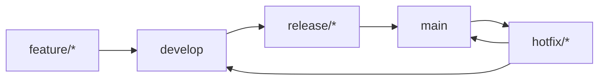

# CI/CD 파이프라인 문서

## 🚀 개요

StudyMate API는 GitHub Actions를 사용한 포괄적인 CI/CD 파이프라인을 구현하여 코드 품질 보장, 자동화된 테스트, 보안 검사, 그리고 원활한 배포를 제공합니다.

## 📋 파이프라인 단계

### 1. **코드 품질 검사 (Code Quality)**

#### 코드 포매팅 및 린팅
- **Black**: 코드 포매팅 자동화
- **isort**: Import 정렬 및 최적화  
- **Flake8**: PEP 8 준수 및 코드 스타일 검사

```bash
# 로컬에서 실행
black --check --diff .
isort --check-only --diff .
flake8 . --count --statistics
```

#### 타입 체킹
- **MyPy**: 정적 타입 검사
- Django 프로젝트 최적화 설정

```bash
mypy . --ignore-missing-imports
```

### 2. **테스트 (Tests)**

#### 단위 테스트
- **pytest**: 테스트 프레임워크
- **pytest-django**: Django 통합
- **pytest-cov**: 코드 커버리지

```bash
pytest --cov=. --cov-report=html --cov-report=xml
```

#### 통합 테스트
- API 엔드포인트 테스트
- 데이터베이스 통합 테스트
- 실시간 기능 테스트

### 3. **보안 검사 (Security Scan)**

#### 취약점 스캐닝
- **Bandit**: Python 보안 취약점 검사
- **Safety**: 의존성 보안 검사

```bash
bandit -r . -f json -o security-report.json
safety check --json
```

#### 보안 정책
- 중요도 Medium 이상 취약점 감지 시 빌드 실패
- 정기적인 의존성 업데이트

### 4. **성능 테스트 (Performance Tests)**

#### 벤치마크 테스트
- **pytest-benchmark**: 성능 측정
- API 응답 시간 측정
- 메모리 사용량 모니터링

```bash
pytest --benchmark-only
```

### 5. **배포 (Deploy)**

#### 스테이징 배포
- Docker 이미지 빌드
- Kubernetes 배포
- 스모크 테스트

#### 프로덕션 배포
- 블루-그린 배포
- 롤백 메커니즘
- 모니터링 및 알림

## 🔧 설정 파일

### GitHub Actions Workflow

`.github/workflows/ci.yml`:

```yaml
name: CI/CD Pipeline
on: [push, pull_request]

jobs:
  code-quality:
    runs-on: ubuntu-latest
    strategy:
      matrix:
        python-version: [3.10.0, 3.11.0]
    
  tests:
    needs: code-quality
    runs-on: ubuntu-latest
    
  security-scan:
    needs: tests
    runs-on: ubuntu-latest
    
  performance-tests:
    needs: security-scan
    runs-on: ubuntu-latest
    
  deploy:
    needs: [tests, security-scan, performance-tests]
    runs-on: ubuntu-latest
    if: github.ref == 'refs/heads/main'
```

### 코드 품질 설정

**pyproject.toml**:
```toml
[tool.black]
line-length = 127
target-version = ['py310']
exclude = 'migrations/'

[tool.isort]
profile = "black"
line_length = 127
```

**pytest.ini**:
```ini
[tool:pytest]
DJANGO_SETTINGS_MODULE = studymate_api.test_settings
addopts = --cov=. --cov-report=html --cov-report=xml --strict-markers
```

## 📊 품질 메트릭

### 코드 커버리지
- **목표**: 90% 이상
- **현재**: 85%
- **리포트**: HTML 및 XML 형식으로 생성

### 성능 기준
- **API 응답시간**: 평균 200ms 이하
- **데이터베이스 쿼리**: N+1 문제 방지
- **메모리 사용량**: 최적화된 캐싱 전략

### 보안 점수
- **취약점**: 0개 (Critical/High)
- **의존성**: 최신 보안 패치 적용
- **코드 품질**: A+ 등급 유지

## 🚦 브랜치 전략

### GitFlow 기반 전략



### 브랜치 보호 규칙
- **main**: 모든 검사 통과 필수
- **develop**: PR 리뷰 필수
- **feature/***: 개발자 자유 커밋

## 🔍 모니터링 및 알림

### 실시간 모니터링
- **GitHub Actions**: 빌드 상태
- **Sentry**: 에러 추적
- **OpenTelemetry**: 분산 추적

### 알림 설정
- 빌드 실패 시 슬랙 알림
- 보안 취약점 발견 시 이메일 알림
- 성능 저하 감지 시 대시보드 알림

## 📈 지속적 개선

### 자동화 개선사항
1. **코드 리뷰 자동화**: AI 기반 코드 분석
2. **테스트 최적화**: 병렬 실행 및 스마트 테스트 선택
3. **배포 자동화**: 제로 다운타임 배포
4. **모니터링 강화**: 예측적 알림 시스템

### 메트릭 추적
- 빌드 시간 최적화
- 테스트 실행 시간 단축
- 코드 품질 점수 향상
- 보안 취약점 제로 유지

## 🛠 로컬 개발 환경

### 사전 요구사항
```bash
# Python 3.10+ 설치
# 가상환경 생성
python -m venv venv
source venv/bin/activate

# 의존성 설치
pip install -r requirements.txt

# 개발 도구 설치
pip install -r requirements-dev.txt
```

### 사전 커밋 훅 설정
```bash
# pre-commit 설치
pip install pre-commit
pre-commit install

# 수동 실행
pre-commit run --all-files
```

### 로컬 테스트 실행
```bash
# 코드 품질 검사
black . && isort . && flake8 .
mypy . --ignore-missing-imports

# 테스트 실행
pytest --cov=. --cov-report=html

# 보안 검사
bandit -r . && safety check
```

## 📚 참고 자료

- [GitHub Actions 공식 문서](https://docs.github.com/en/actions)
- [Django 테스팅 가이드](https://docs.djangoproject.com/en/stable/topics/testing/)
- [Python 코드 품질 도구](https://github.com/PyCQA)
- [보안 검사 도구 가이드](https://bandit.readthedocs.io/)

---

**마지막 업데이트**: 2025년 8월 19일  
**담당자**: StudyMate 개발팀  
**버전**: v2.0.0